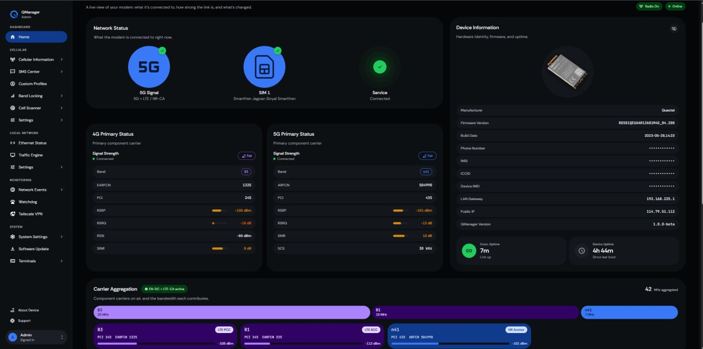

# QManager

<div align="center">
  
  <h3>Modern, High-Performance Single-Binary Web & Telemetry Engine for Quectel Modems</h3>
  <p>Standalone Go Engine + Embedded Next.js 15 Web UI for Quectel RM520N-GL & RG501Q-EU</p>

  
  
  
  
</div>

---

<div align="center">
  
</div>

---

## Overview

**QManager** is an all-in-one cellular management appliance and telemetry daemon built for Qualcomm-based Quectel modems (including **RM520N-GL** and **RG501Q-EU**). 

Replacing legacy Lighttpd web servers, shell CGI scripts, and external helper binaries, QManager compiles down to a **single, zero-dependency standalone binary** (`qmanager-armv7`) with the optimized Next.js frontend embedded directly into the Go executable via `embed.FS`.

### Key Advantages
- **Single Static Binary**: Zero external runtime requirements (no Lighttpd, PHP, Python, Entware, or Rust dependencies).
- **Direct Character Device Access**: High-performance pure-Go AT command engine interfacing directly with `/dev/smd11` (or fallback `/dev/smd7` / `/dev/ttyUSB2`) with thread-safe Mutex serialization.
- **Embedded Web & API Server**: High-throughput Chi HTTP router with sub-millisecond response times and backward-compatible `/cgi-bin/quecmanager/*` routing.
- **Real-Time Telemetry & Probing**: Continuous background signal polling (1 Hz), TCP latency prober (1.1.1.1:53), and memory/temperature accounting.
- **4-Tier Connection Watchdog**: Automated recovery pipeline (AT+CFUN radio restart -> network stack restart -> modem system reboot).
- **1970 Clock-Step Resistant Scheduler**: Go-native monotonic timer evaluation that ignores spurious RTC step misfires during uncalibrated modem boot.
- **SMS Engine & Forwarder**: Pure-Go 3GPP SMS poller and forwarder supporting multi-channel delivery.

---

## Architecture

```text
┌────────────────────────────────────────────────────────┐
│                   QManager Single Binary               │
│                                                        │
│  ┌────────────────────────┐  ┌──────────────────────┐  │
│  │   Embedded Frontend    │  │     Chi HTTP API     │  │
│  │  (Next.js 15 / React)  │  │  (REST + CGI compat) │  │
│  └────────────────────────┘  └──────────────────────┘  │
│                                                        │
│  ┌──────────────────────────────────────────────────┐  │
│  │               Core Go Daemon Engine              │  │
│  │  ┌──────────────┐ ┌──────────────┐ ┌──────────┐  │  │
│  │  │   Telemetry  │ │  Connection  │ │ Monotonic│  │  │
│  │  │    Poller    │ │   Watchdog   │ │Scheduler │  │  │
│  │  └──────────────┘ └──────────────┘ └──────────┘  │  │
│  └──────────────────────────────────────────────────┘  │
│                                                        │
│  ┌──────────────────────────────────────────────────┐  │
│  │         Thread-Safe AT Command Transport         │  │
│  │   Direct Character Device (/dev/smd11, /dev/smd7)│  │
│  └──────────────────────────────────────────────────┘  │
└──────────────────────────┬─────────────────────────────┘
                           │
                 /dev/smd11 (Character Device)
                           │
                           ▼
              Qualcomm Baseband Processor
```

---

## Features

- **Live Signal Monitoring** — Real-time RSRP, RSRQ, SINR with per-antenna metrics and 60-second rolling charts.
- **Cell & Tower Locking** — Full LTE & NR SA carrier locking by EARFCN/ARFCN and PCI with automated schedule and failover guards.
- **Band Configuration** — Direct band selection for LTE (B1–B71) and 5G NR (n1–n78).
- **Network Optimization** — Custom TTL/Hop Limit configuration, IP Passthrough mode, MTU management, and custom DNS.
- **DPI Bypass / Video Optimizer** — Native TCP window scaling and streaming optimization controls.
- **SIM & APN Profiles** — Multi-PDP context management, MNO presets, and automated ICCID SIM profile binding.
- **Connection Watchdog** — 4-tier link monitoring and automatic modem recovery.
- **SMS Center** — In-browser SMS inbox/outbox and background forwarding engine.
- **Hardware Profile & Self-Heal** — Real-time detection and verification of modem model, SoC (SDX55/SDX65), form factor, and firmware revision.

---

## Building from Source

### Prerequisites
- [Go 1.22+](https://golang.org/)
- [Bun](https://bun.sh/) (or Node.js 20+)
- `make` and standard POSIX build tools

### Build Commands

```bash
# 1. Full Build (Frontend Static Export + Go ARMv7 Binary)
make build

# 2. Build Frontend Only
make build-frontend

# 3. Build Backend Only (Cross-compilation for ARMv7 / Quectel Linux)
make build-backend

# 4. Package Release Tarball (qmanager-armv7.tar.gz)
make package

# 5. Run Backend Unit & Regression Tests
make test
```

---

## Installation & Deployment

### Quick Install to Device

1. Download or package `qmanager-armv7.tar.gz`.
2. Transfer archive to your modem via SCP or ADB:
   ```bash
   scp qmanager-armv7.tar.gz root@192.168.225.1:/tmp/
   ```
3. SSH into the modem and run the installer:
   ```bash
   ssh root@192.168.225.1
   cd /tmp && tar -xzf qmanager-armv7.tar.gz
   chmod +x install.sh
   ./install.sh
   ```

The installer stops legacy daemons, places the binary at `/usrdata/qmanager/qmanager`, sets up `/etc/systemd/system/qmanager.service`, and starts the service.

### Service Management

```bash
# Check service status
systemctl status qmanager

# View live daemon logs
journalctl -u qmanager -f

# Restart service
systemctl restart qmanager
```

---

## License

This project is licensed under the [MIT License with Commons Clause](LICENSE).
Personal, educational, and non-commercial use is permitted. Commercial use, redistribution, or bundling into commercial hardware requires a commercial license from the author.
