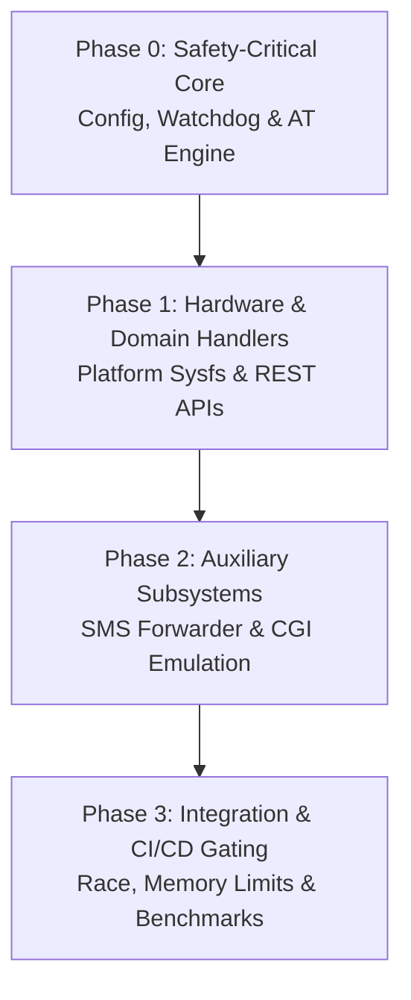

# Backend Go Test Coverage & Quality Engineering Plan

> **Target Device Architecture:** Quectel RG501Q-EU (SDX55, Linux 4.14, UBIFS NAND) & Quectel RM520N-GL (SDX65, Linux 5.4, UBIFS NAND)  
> **Appliance Model:** Single standalone Go binary (`qmanager-armv7`) with embedded Next.js 15 UI (`dist/`)  
> **Initial Baseline Coverage:** **46.5%** Total Statement Coverage  
> **Target KPI:** **≥ 85%** Total Coverage, **≥ 95%** on P0 safety-critical modules

---

## 1. Executive Summary & Baseline Matrix

A complete scan of `backend/` identified significant test coverage gaps in hardware abstraction, watchdog recovery, persistence safety, and domain REST handlers. Because QManager operates directly on production modem baseband processors and raw UBIFS NAND storage, unit test coverage is essential for device safety.

### Baseline Coverage Status

| Package | Role | Baseline Coverage | Target Coverage | Priority |
| :--- | :--- | :--- | :--- | :--- |
| `internal/config` | Flash-Safe Config Persistence & Mutex | **68.1%** | **95.0%** | **P0 (Critical)** |
| `internal/telemetry` | 4-Tier Watchdog, Ring Buffers, Prober | **46.1%** | **90.0%** | **P0 (Critical)** |
| `internal/atengine` | 3-Tier Priority Queue & Low-Alloc Parser | **70.2%** | **90.0%** | **P0 (Critical)** |
| `internal/platform` | Sysfs Hardware Identity & Thermal Probing | **0.0%** | **85.0%** | **P1 (High)** |
| `internal/api/handlers` | Domain REST Handlers & Legacy CGI | **30.6%** | **80.0%** | **P1 (High)** |
| `internal/api/router` | Chi HTTP Router & SPA Fallback Server | **99.2%** | **100.0%** | **P2 (Maintenance)** |
| `cmd/qmanager` | Main Lifecycle & Embedding | **0.0%** | **50.0%** | **P2 (Smoke)** |

---

## 2. Embedded Guardrails & Testing Principles

Every test suite added must comply with strict embedded safety rules:

1. **Zero Flash Wear Protection**:
   - Tests validating persistence must use `t.TempDir()` in memory/tmpfs.
   - Assert that background telemetry, pings, and loggers perform zero disk writes.
2. **Modern Go Standards**:
   - Apply Modern Go Guidelines: `errors.Is`, `errors.AsType[T]`, `errors.Join`, `context.WithCancelCause`.
   - Prefer table-driven sub-tests (`t.Run(tt.name, func(t *testing.T) { ... })`).
3. **Race Condition & Deadlock Safety**:
   - All tests must pass with `go test -race ./...`.
   - Half-duplex AT queue concurrency tests must guarantee that emergency high-priority commands never block behind background 1 Hz polling loops.

---

## 3. Phased Implementation Breakdown



---

### Phase 0: Safety-Critical Core (P0)

Focus: Prevent modem bricking, infinite reboot loops, and NAND flash exhaustion.

#### Task 0.1: Config Persistence & Atomic Write Hardening (`internal/config`)
- [ ] **Symlink Trap Test**: Create a symlink pointing to a sensitive path; assert `Save()` refuses write through symlink.
- [ ] **Atomic Swap Verification**: Verify that target files are written to `.tmp.<nano>`, synced with `file.Sync()`, and atomically renamed.
- [ ] **Concurrent Mutations**: Run 50 parallel reader goroutines and 20 writer goroutines to assert mutex integrity (`-race`).
- [ ] **Disk Fault Recovery**: Simulate write errors (read-only destination) to assert graceful error propagation without panicking.

#### Task 0.2: 4-Tier Watchdog State Machine (`internal/telemetry/watchdog.go`)
- [ ] **Tier Escalation Test Suite**:
  - `Tier 1`: Verify data registration reset (`AT+CGATT=0/1`) triggers after threshold $N_1$ failures.
  - `Tier 2`: Verify radio power-cycle (`AT+CFUN=0/1`) triggers after threshold $N_2$ failures.
  - `Tier 3`: Verify SIM slot switch command triggers after threshold $N_3$ failures.
  - `Tier 4`: Verify modem reboot rate-limiter prevents more than $M$ reboots per hour.
- [ ] **Recovery & Counter Reset**: Assert that a single successful ping probe immediately resets the failure counter to `0`.
- [ ] **Clock-Step Guard (1970 Epoch Jump)**: Assert watchdog timers handle NTP/1970 clock jumps safely without premature triggering.

#### Task 0.3: 3-Tier Priority AT Queue Arbitration (`internal/atengine/engine.go`)
- [ ] **Priority Inversion Test**: Saturated `PriorityLow` channel (100 background 1 Hz queries) must not delay `PriorityHigh` (emergency recovery/CFUN) by more than 1 queue tick.
- [ ] **Context Cancellation / Timeout**: Assert that timed-out commands cleanly abort and do not leak goroutines or corrupt the half-duplex serial state.
- [ ] **Unsolicited Response (URC) Filter**: Ensure asynchronous network notifications (`+QIURC`, `RING`) do not break active command reply parsers.

---

### Phase 1: Hardware Abstraction & API Handlers (P1)

Focus: Prevent hardware crashes on varying Linux kernels and validate REST API request sanitization.

#### Task 1.1: Sysfs & Hardware Detection Engine (`internal/platform`)
- [ ] **Mock Kernel 4.14 vs 5.4 Sysfs**: Table-driven tests supplying mock file system structures for `/proc/meminfo`, `/proc/net/dev`, and `/sys/class/thermal`.
- [ ] **Missing Sensor Fallback**: Verify CPU thermal reads return `0.0` or `"unknown"` gracefully when thermal zone nodes are missing.
- [ ] **Platform Matrix Matching**:
  - Mock Quectel RG501Q-EU project string (`RG501QEUBR...`).
  - Mock Quectel RM520N-GL project string (`RM520NGLAA...`).
  - Test unsupported modem hardware fallback behavior.

#### Task 1.2: Cellular, Band Locking & Network Handlers (`internal/api/handlers`)
- [ ] **Band Lock Hex/Dec Formatter**:
  - Test valid LTE band masks (e.g., Band 1, 3, 7, 8, 20, 28, 38, 40).
  - Test valid NR5G NSA/SA band masks (e.g., n1, n3, n28, n40, n77, n78).
  - Assert that malformed band strings return `400 Bad Request` before calling baseband AT commands.
- [ ] **IMEI Changer Validator**: Assert 14-15 digit numeric validation and Luhn checksum rejection for invalid IMEI modifications.
- [ ] **APN Profile Management**: Test APN mutation, auth type (`PAP`/`CHAP`/`NONE`), and IP type (`IPv4`/`IPv6`/`IPv4v6`) payloads.
- [ ] **TTL / HL Mangling Handlers**: Test iptables/nftables TTL rules configuration and validation.

---

### Phase 2: Auxiliary Subsystems & Backward Compatibility (P2)

Focus: SMS pipelines, latency prober lifecycle, and legacy CGI scripts.

#### Task 2.1: SMS Forwarder & Ping Prober Lifecycle (`internal/telemetry`)
- [ ] **Ping Prober Loop**: Test ICMP/HTTP probe targets with mock network responses, timeout handling, and latency ring buffer accumulation.
- [ ] **SMS Forwarder Dispatcher**: Test webhook/Telegram payload generation on incoming SMS notifications (`+CMTI`).
- [ ] **Clean Shutdown**: Verify calling `Stop()` on telemetry services cleanly terminates all background worker goroutines via `sync.WaitGroup`.

#### Task 2.2: Legacy CGI Emulation Handlers (`internal/api/handlers/cgi.go`)
- [ ] **CGI Route Compatibility**: Test legacy endpoints (`/cgi-bin/qmanager/*.sh`) against mock responses to ensure backward compatibility with older shell-based UI scripts.

---

### Phase 3: Integration, Benchmarking & CI/CD Gating (P3)

Focus: Enforce memory ceiling (<20MB RSS) and continuous quality gating.

#### Task 3.1: Zero-Allocation Parser Benchmarks (`internal/atengine`)
- [ ] **Benchmark AT Parsers**: Benchmark `parseQENG`, `parseQCAINFO`, and `parseCSQ`.
- [ ] **Zero-Allocation Assertion**: Ensure hot-path 1 Hz telemetry parsers allocate `0 B/op` or `< 2 allocs/op`.

#### Task 3.2: Automated Coverage Gating in Makefile / CI
- [ ] Add Makefile targets:
  ```makefile
  test:
  	cd backend && go test -v -race ./...

  test-coverage:
  	cd backend && go test -v -coverprofile=coverage.out -covermode=atomic ./...
  	cd backend && go tool cover -func=coverage.out
  	cd backend && go tool cover -html=coverage.out -o coverage.html
  ```
- [ ] Enforce CI failure if total backend statement coverage drops below 80%.

---

## 4. Execution Roadmap & Verification Commands

| Step | Scope | Primary Packages | Target |
| :---: | :--- | :--- | :---: |
| **S1** | Config & Flash Safety Tests | `internal/config` | 95% |
| **S2** | Watchdog & AT Engine Arbitration | `internal/telemetry`, `internal/atengine` | 90% |
| **S3** | Sysfs & Platform Detection Suite | `internal/platform` | 85% |
| **S4** | Cellular & Network API Handlers | `internal/api/handlers` | 80% |
| **S5** | Benchmark & Race Verification | All backend packages | Pass |

### Quick Verification Checklist

```powershell
# Run all unit tests with data race detector
cd backend; go test -race -v ./...

# Generate per-package coverage summary
cd backend; go test -coverprofile=coverage.out ./...; go tool cover -func=coverage.out

# Verify Modern Go guidelines compliance
& 'C:\Users\latif\.agents\skills\use-modern-go\scripts\run-tool.ps1' list --file-path "backend/internal/atengine/engine.go"
```
